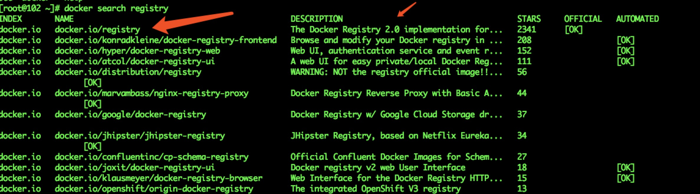

# Docker 私服

## 意义
   企业搭建私服主要是镜像的安全性考虑与镜像的内网传输速度

## 步骤
1. 搜索镜像： ``` docker search registry ```

 

2. 拉取镜像：```docker pull docker.io/registry```

3. 验证：```docker images``` 查看本地镜像列表

4. 运行: 对外端口5000 后台默认运行，起别名registry

 ```docker run -p5000:5000 -d docker.io/registry --name=registry```

5. 运行验证：
    1. ```dcoker ps```
    2. telnet 192.168.0.102 5000

6. 镜像上传私服(以镜像huahan/wx为例)(192.168.0.102是指docker私服的Ip地址)
   1. 打tag：```docker tag 192.168.0.102:5000/huahan/wx```
   2. push： ```docker push 192.168.0.102:5000/huahan/wx```
   3. 验证：```curl -XGET http://192.168.0.102:5000/v2/_catalog```
      得到回应```{"repositories":["huahan/wx"]}``
      
7. 在部署机上运行
  ```docker run -p 8080:8080 -d 192.168.0.102:5000/huahan/wx```

## 遇到的问题
1. 在镜像上传私服或者下载镜像的时候遇到如下错误
    ```
    Error response from daemon: Get https://192.168.0.102:5000/v2/: http: server gave HTTP response to HTTPS client.
    ```
    1. 原因：

       私服默认都是开启https传输，普通http请求方式就会出现如上错误

    2. 解决方案：更改docker配置文件（/etc/docker/daemon.json），增加如下配置
    ```
    "insecure-registries" : [
           "192.168.0.102:5000"
    ],
    ```

    3. [参考](https://docs.docker.com/engine/reference/commandline/dockerd/#daemon-configuration-file)


